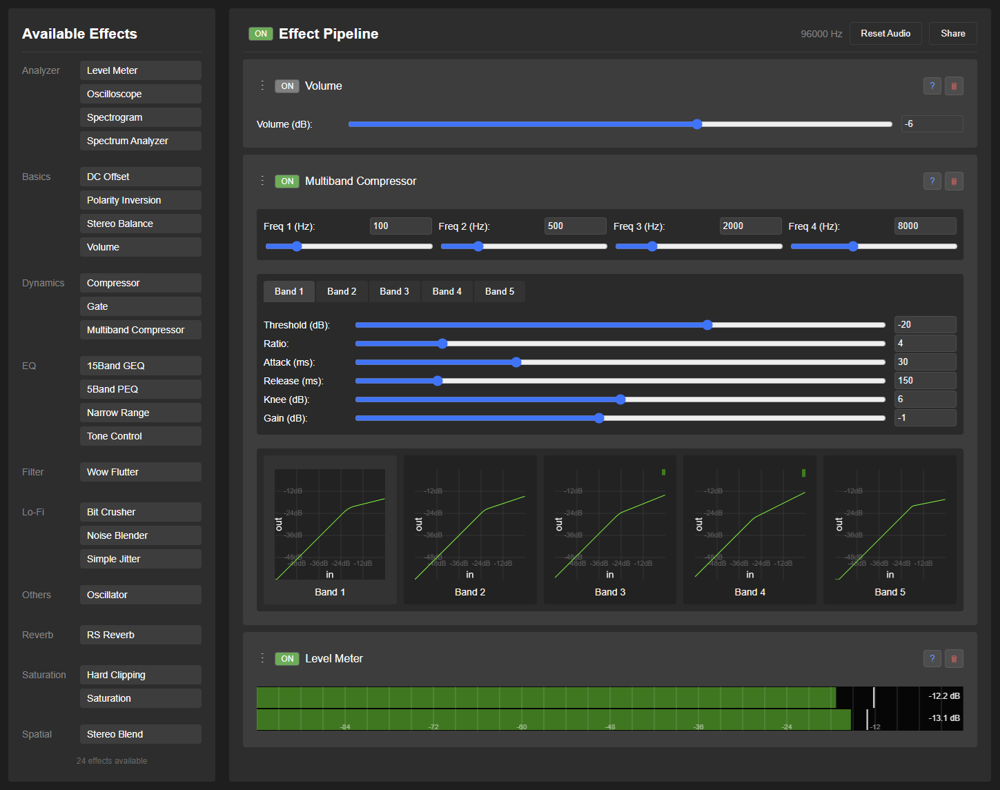
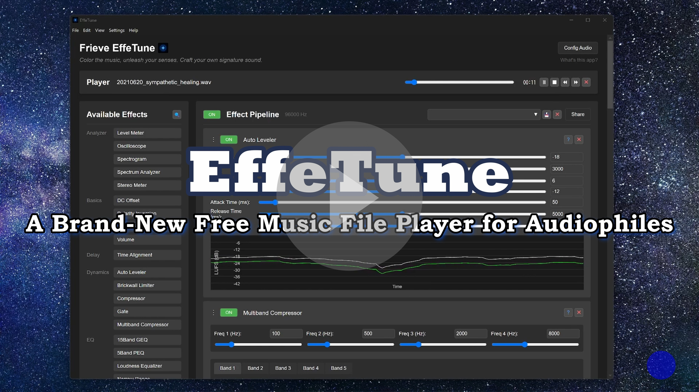

# Frieve EffeTune 

  <a class="button button-primary" href="https://effetune.frieve.com/effetune.html">वेब ऐप खोलें</a>
  <install class="button button-secondary"><a href="https://effetune.frieve.com/effetune.html">PWA संस्करण इंस्टॉल करें</a></install>
  <a class="button button-secondary" href="https://github.com/Frieve-A/effetune/releases/">डेस्कटॉप ऐप डाउनलोड करें</a>

EffeTune रियल-टाइम ऑडियो इफेक्ट प्रोसेसर है, जिसे संगीत सुनने के अनुभव को अपनी पसंद के अनुसार बेहतर बनाने वाले ऑडियो उत्साही लोगों के लिए बनाया गया है। यह किसी भी ऑडियो स्रोत को कई उच्च-गुणवत्ता वाले इफेक्ट्स से प्रोसेस कर सकता है, ताकि आप सुनते समय ही ध्वनि को अपने स्वाद के अनुसार ढाल सकें।

## परिचय वीडियो

## अवधारणा

EffeTune उन ऑडियो उत्साही लोगों के लिए बनाया गया है जो संगीत को अपनी पसंद की ध्वनि में सुनना चाहते हैं। चाहे आप स्ट्रीमिंग से सुन रहे हों या फिजिकल मीडिया से चला रहे हों, EffeTune आपको उच्च-गुणवत्ता वाले इफेक्ट्स जोड़कर ध्वनि को अपनी पसंद के अनुसार समायोजित करने देता है। अपने कंप्यूटर को ऐसा शक्तिशाली ऑडियो इफेक्ट प्रोसेसर बनाएं जो आपके ऑडियो स्रोत और स्पीकर या एम्पलीफायर के बीच काम कर सके।

ऑडियोफाइल मिथकों की जगह, साफ विज्ञान।

## विशेषताएं

- रियल-टाइम ऑडियो प्रोसेसिंग
- इफेक्ट चेन बनाने के लिए ड्रैग-एंड-ड्रॉप इंटरफेस
- श्रेणियों में व्यवस्थित, विस्तार योग्य इफेक्ट सिस्टम
- लाइव ऑडियो विज़ुअलाइज़ेशन
- रियल-टाइम में बदली जा सकने वाली ऑडियो पाइपलाइन
- मौजूदा इफेक्ट चेन के साथ ऑफलाइन ऑडियो फ़ाइल प्रोसेसिंग
- स्थानीय सबफ़ोल्डर, मेटाडेटा और प्लेलिस्ट ब्राउज़ करने के लिए संगीत लाइब्रेरी
- playback setup को सुधारने के लिए फ्रीक्वेंसी रिस्पॉन्स मापन और correction
- मल्टी-चैनल प्रोसेसिंग और आउटपुट

## सेटअप गाइड

EffeTune का उपयोग करने से पहले ऑडियो रूटिंग सेट करना होगा। अलग-अलग ऑडियो स्रोतों के लिए सेटअप इस तरह करें:

### संगीत फ़ाइल प्लेयर सेटअप

- ब्राउज़र में EffeTune वेब ऐप खोलें, या EffeTune डेस्कटॉप ऐप लॉन्च करें
- सही प्लेबैक की जांच के लिए कोई संगीत फ़ाइल खोलकर चलाएं
   - कोई संगीत फ़ाइल खोलें और एप्लिकेशन के रूप में EffeTune चुनें (केवल डेस्कटॉप ऐप)
   - या फ़ाइल मेनू से संगीत फ़ाइल खोलें... चुनें (केवल डेस्कटॉप ऐप)
   - या संगीत फ़ाइल को विंडो में ड्रैग करें
- केवल संगीत फ़ाइल प्लेयर के लिए, ऑडियो विन्यास में इनपुट डिवाइस के रूप में कोई नहीं (केवल संगीत फ़ाइल प्लेयर) चुनें ताकि लाइव ऑडियो इनपुट का उपयोग न हो

### स्ट्रीमिंग सेवा सेटअप

स्ट्रीमिंग सेवाओं (Spotify, YouTube Music आदि) से ऑडियो प्रोसेस करने के लिए:

1. पूर्व आवश्यकताएं:
   - कोई वर्चुअल ऑडियो डिवाइस इंस्टॉल करें (जैसे VB Cable, Voice Meeter, या ASIO Link Tool)
   - अपनी स्ट्रीमिंग सेवा का ऑडियो आउटपुट उस वर्चुअल ऑडियो डिवाइस पर सेट करें

2. कॉन्फ़िगरेशन:
   - ब्राउज़र में EffeTune वेब ऐप खोलें, या EffeTune डेस्कटॉप ऐप लॉन्च करें
   - इनपुट स्रोत के रूप में वर्चुअल ऑडियो डिवाइस चुनें
     - Chrome में पहली बार खोलने पर ऑडियो इनपुट चुनने और अनुमति देने के लिए डायलॉग बॉक्स दिखाई देता है
     - डेस्कटॉप ऐप में, स्क्रीन के ऊपर दाईं ओर Config Audio बटन पर क्लिक करके सेट करें
   - अपनी स्ट्रीमिंग सेवा में संगीत चलाना शुरू करें
   - जांचें कि ऑडियो EffeTune से होकर आ रहा है
   - अधिक विस्तृत सेटअप निर्देशों के लिए [FAQ](faq.md) देखें

### भौतिक ऑडियो स्रोत सेटअप

CD प्लेयर, नेटवर्क प्लेयर या अन्य भौतिक स्रोतों के साथ EffeTune का उपयोग करने के लिए:

- अपने ऑडियो इंटरफेस को कंप्यूटर से कनेक्ट करें
- ब्राउज़र में EffeTune वेब ऐप खोलें, या EffeTune डेस्कटॉप ऐप लॉन्च करें
- अपने ऑडियो इंटरफेस को इनपुट और आउटपुट स्रोत के रूप में चुनें
   - Chrome में पहली बार खोलने पर ऑडियो इनपुट चुनने और अनुमति देने के लिए डायलॉग बॉक्स दिखाई देता है
   - डेस्कटॉप ऐप में, स्क्रीन के ऊपर दाईं ओर Config Audio बटन पर क्लिक करके सेट करें
- अब आपका ऑडियो इंटरफेस मल्टी-इफेक्ट प्रोसेसर की तरह काम करता है:
   * इनपुट: आपका CD प्लेयर, नेटवर्क प्लेयर या अन्य ऑडियो स्रोत
   * प्रोसेसिंग: EffeTune के जरिए रियल-टाइम इफेक्ट्स
   * आउटपुट: प्रोसेस किया हुआ ऑडियो आपके एम्पलीफायर या स्पीकर तक

## उपयोग

### एप्लिकेशन सेटिंग्स

**सेटिंग्स** मेनू में **कॉन्फ़िगरेशन...** खोलें। यहां आप भाषा, **स्टार्टअप पर दिखाया जाने वाला दृश्य:**, और स्टार्टअप पर Effect Pipeline के व्यवहार को चुन सकते हैं। स्टार्टअप दृश्य के लिए **Effect Pipeline (डिफ़ॉल्ट)** या **संगीत लाइब्रेरी** चुना जा सकता है। अगर आप **संगीत लाइब्रेरी** चुनते हैं, तो साथ दी गई सूची से तय करें कि सबसे पहले कौन-सा दृश्य खुले: **ट्रैक**, **एल्बम**, **कलाकार**, **शैलियाँ**, या **सबफ़ोल्डर**।

### संगीत लाइब्रेरी में संगीत ढूँढना

1. PC पर हेडर में **संगीत लाइब्रेरी** बटन से, मोबाइल पर **लाइब्रेरी** टैब से, और डेस्कटॉप ऐप में **देखें > संगीत लाइब्रेरी** से खोलें।
2. **संगीत फ़ोल्डर जोड़ें** चुनें और संगीत फ़ाइलों वाले फ़ोल्डर को इंडेक्स करें।
3. **ट्रैक**, **एल्बम**, **कलाकार**, **शैलियाँ**, **सबफ़ोल्डर**, **फ़ोल्डर**, **हाल में जोड़े गए**, और **प्लेलिस्ट** से ब्राउज़ करें, और **लाइब्रेरी खोजें** से पूरे कैटलॉग में खोजें। **सबफ़ोल्डर** दृश्य हर इंडेक्स किए गए संगीत फ़ोल्डर के भीतर ट्रैक को उनके पथ के अनुसार समूहित करता है, जबकि **फ़ोल्डर** दृश्य उन रूट फ़ोल्डरों को प्रबंधित करता है। मौजूदा लाइब्रेरियों में यह वर्गीकरण दोबारा स्कैन किए या संग्रहण फ़ॉर्मेट माइग्रेट किए बिना उपलब्ध हो जाता है।
4. मिले हुए ट्रैक मौजूदा Effect Pipeline से चलाए जा सकते हैं, और **अगला चलाएँ**, **कतार में जोड़ें**, तथा **प्लेलिस्ट में जोड़ें** से प्लेबैक क्रम और प्लेलिस्ट संभाली जा सकती हैं।
5. फ़ाइलों में बदलाव के बाद **फिर से स्कैन करें** का उपयोग करें, और यदि ब्राउज़र या फ़ोल्डर की अनुमति समाप्त हो जाए तो **फिर से कनेक्ट करें** का उपयोग करें।
   - [संगीत लाइब्रेरी के बारे में विस्तार से](music-library.md)

### अपनी Effect Chain बनाना

1. Available Effects स्क्रीन के बाईं ओर दिखते हैं
   - इफेक्ट्स फ़िल्टर करने के लिए "Available Effects" के पास वाला search बटन इस्तेमाल करें
   - नाम या श्रेणी से इफेक्ट खोजने के लिए कोई भी टेक्स्ट टाइप करें
   - खोज साफ करने के लिए ESC दबाएं
2. सूची से इफेक्ट्स को Effect Pipeline क्षेत्र में ड्रैग करें
3. इफेक्ट्स ऊपर से नीचे के क्रम में प्रोसेस होते हैं
4. क्रम बदलने के लिए हैंडल (⋮) ड्रैग करें या ▲▼ बटन क्लिक करें
   - Section इफेक्ट्स के लिए: पूरे सेक्शन को खिसकाने के लिए Shift+click के साथ ▲▼ बटन इस्तेमाल करें (एक Section से अगले Section, पाइपलाइन की शुरुआत या पाइपलाइन के अंत तक)
5. सेटिंग्स खोलने/बंद करने के लिए इफेक्ट के नाम पर क्लिक करें
   - Section इफेक्ट पर Shift+click करने से उस सेक्शन के सभी इफेक्ट्स खुलते/बंद होते हैं
   - दूसरे इफेक्ट्स पर Shift+click करने से Analyzer श्रेणी को छोड़कर सभी इफेक्ट्स खुलते/बंद होते हैं
   - Ctrl+click करने से सभी इफेक्ट्स खुलते/बंद होते हैं
6. किसी एक इफेक्ट को बायपास करने के लिए ON बटन इस्तेमाल करें
7. विस्तृत दस्तावेज़ नए टैब में खोलने के लिए ? बटन क्लिक करें
8. इफेक्ट हटाने के लिए × बटन इस्तेमाल करें
   - Section इफेक्ट्स के लिए: पूरे सेक्शन को हटाने के लिए Shift+click के साथ × बटन इस्तेमाल करें
9. प्रोसेस होने वाले चैनल और इनपुट/आउटपुट बस सेट करने के लिए routing बटन क्लिक करें
   - [बस फंक्शन के बारे में अधिक जानकारी](bus-function.md)

### प्रीसेट्स का उपयोग

1. अपनी Effect Chain सहेजें:
   - इच्छित इफेक्ट चेन और पैरामीटर सेट करें
   - इनपुट फील्ड में प्रीसेट का नाम दर्ज करें
   - उसे सहेजने के लिए save बटन क्लिक करें

2. प्रीसेट लोड करें:
   - ड्रॉपडाउन सूची से प्रीसेट नाम टाइप या चुनें
   - प्रीसेट अपने-आप लोड हो जाएगा
   - सभी इफेक्ट्स और उनकी सेटिंग्स वापस आ जाएंगी

3. प्रीसेट हटाएं:
   - हटाने वाला प्रीसेट चुनें
   - delete बटन क्लिक करें
   - संकेत मिलने पर हटाने की पुष्टि करें

4. प्रीसेट जानकारी:
   - हर प्रीसेट आपकी पूरी इफेक्ट चेन कॉन्फ़िगरेशन सहेजता है
   - इसमें इफेक्ट क्रम, पैरामीटर और स्थितियां शामिल होती हैं

### Section फीचर्स का उपयोग

1. Section इफेक्ट का उपयोग:
   - इफेक्ट्स के समूह की शुरुआत में Section इफेक्ट जोड़ें
   - Comment फील्ड में कोई स्पष्ट नाम दर्ज करें
   - Section ON/OFF बदलने से उस सेक्शन को बायपास या वापस चालू किया जा सकता है, जबकि हर इफेक्ट की अपनी ON/OFF स्थिति सुरक्षित रहती है
   - इफेक्ट चेन को तार्किक समूहों में बांटने के लिए कई Section इफेक्ट्स इस्तेमाल करें
   - [control effects के बारे में अधिक जानकारी](plugins/control.md)

### AB Pipeline फीचर्स का उपयोग

1. AB Pipeline अवलोकन:
   - EffeTune दो अलग-अलग इफेक्ट पाइपलाइन रख सकता है: Pipeline A और Pipeline B
   - स्टार्टअप पर केवल Pipeline A लोड होती है; Pipeline B जरूरत पड़ने पर बनाई जाती है
   - सारी प्रोसेसिंग, सेविंग, लोडिंग और एडिटिंग मौजूदा चुनी हुई पाइपलाइन पर होती है

2. AB Toggle Button:
   - Effect Pipeline हेडर के दाईं ओर होता है
   - डिफ़ॉल्ट रूप से "A" दिखाता है (Pipeline A सक्रिय)
   - Pipeline A और Pipeline B के बीच स्विच करने के लिए क्लिक करें
   - अगर स्विच करते समय Pipeline B मौजूद नहीं है, तो Pipeline A की सेटिंग्स Pipeline B में कॉपी हो जाती हैं

3. AB Menu (Dropdown Button):
   - AB toggle button के दाईं ओर होता है
   - "A → B": Pipeline A की सेटिंग्स Pipeline B में कॉपी करता है और Pipeline B पर स्विच करता है
   - "B → A": Pipeline B की सेटिंग्स Pipeline A में कॉपी करता है और Pipeline A पर स्विच करता है

4. Double Blind Test:
   - Pipeline A और Pipeline B को यह जाने बिना सुनकर तुलना करें कि कौन-सी pipeline चल रही है
   - ABX Test से जांचें कि आप दोनों pipelines को सचमुच अलग पहचान सकते हैं या नहीं, या A/B Preference Test से पता करें कि आपको कौन-सी पसंद है; परिणाम में statistical significance भी दिखाई जाती है
   - AB toggle button के दाईं ओर ▼ pipeline menu से खोलें (डेस्कटॉप ऐप में **फ़ाइल** menu से भी उपलब्ध)
   - [Double Blind Test के बारे में अधिक जानकारी](double-blind-test.md)

### इफेक्ट चयन और कीबोर्ड शॉर्टकट्स

1. इफेक्ट चयन विधियां:
   - किसी एक इफेक्ट को चुनने के लिए उसके header पर क्लिक करें
   - कई इफेक्ट्स चुनने के लिए Ctrl दबाकर क्लिक करें
   - सभी इफेक्ट्स का चयन हटाने के लिए Pipeline क्षेत्र की खाली जगह पर क्लिक करें

2. कीबोर्ड शॉर्टकट्स:
   - Ctrl + Z: पूर्ववत करें
   - Ctrl + Y: फिर से करें
   - Ctrl + S: मौजूदा पाइपलाइन सहेजें
   - Ctrl + Shift + S: मौजूदा पाइपलाइन को नए नाम से सहेजें
   - Ctrl + X: चुने हुए इफेक्ट्स काटें
   - Ctrl + C: चुने हुए इफेक्ट्स कॉपी करें
   - Ctrl + V: क्लिपबोर्ड से इफेक्ट्स पेस्ट करें
   - Ctrl + F: इफेक्ट्स खोजें
   - Ctrl + A: पाइपलाइन के सभी इफेक्ट्स चुनें
   - Delete: चुने हुए इफेक्ट्स हटाएं
   - ESC: सभी इफेक्ट्स का चयन हटाएं
   - T: Pipeline A और Pipeline B के बीच स्विच करें
   - A: Pipeline A पर स्विच करें
   - B: Pipeline B पर स्विच करें

3. कीबोर्ड शॉर्टकट्स (प्लेयर इस्तेमाल करते समय):
   - Space: Play/Pause
   - Ctrl + → या N: अगला ट्रैक
   - Ctrl + ← या P: पिछला ट्रैक
   - Shift + → या F या .: 10 सेकंड आगे
   - Shift + ← या R या ,: 10 सेकंड पीछे
   - Ctrl + M: Repeat mode टॉगल करें
   - Ctrl + H: Shuffle mode टॉगल करें
   - T: Pipeline A/B टॉगल करें
   - A: Pipeline A पर स्विच करें
   - B: Pipeline B पर स्विच करें

### ऑडियो फ़ाइलों को प्रोसेस करना

1. फ़ाइल ड्रॉप या फ़ाइल स्पेसिफिकेशन क्षेत्र:
   - Effect Pipeline के नीचे एक समर्पित ड्रॉप क्षेत्र हमेशा दिखाई देता है
   - एक या कई ऑडियो फ़ाइलों का समर्थन करता है
   - फ़ाइलें मौजूदा Pipeline सेटिंग्स से प्रोसेस होती हैं
   - सारी प्रोसेसिंग Pipeline के sample rate पर होती है

2. प्रोसेसिंग स्थिति:
   - प्रोग्रेस बार मौजूदा प्रोसेसिंग स्थिति दिखाता है
   - प्रोसेसिंग समय फ़ाइल आकार और इफेक्ट चेन की जटिलता पर निर्भर करता है

3. डाउनलोड या सेव विकल्प:
   - प्रोसेस की गई फ़ाइल WAV फ़ॉर्मेट में आउटपुट होती है
   - कई फ़ाइलों के लिए, प्रोसेसिंग शुरू होने से पहले आउटपुट फ़ोल्डर चुनें; हर फ़ाइल पूरी होते ही सीधे उसी फ़ोल्डर में सहेजी जाती है
   - पुराने ब्राउज़र जिनमें फ़ोल्डर चयन समर्थित नहीं है, उनमें कई फ़ाइलें डाउनलोड के लिए ZIP फ़ाइल में पैक की जाती हैं

### Effect Chain साझा करना

आप अपनी effect chain configuration दूसरे उपयोगकर्ताओं से साझा कर सकते हैं:
1. इच्छित इफेक्ट चेन सेट करने के बाद, Effect Pipeline क्षेत्र के ऊपर दाईं ओर "Share" बटन क्लिक करें
2. वेब ऐप URL अपने-आप आपके क्लिपबोर्ड में कॉपी हो जाएगा
3. कॉपी किया हुआ URL दूसरों से साझा करें - वे उसे खोलकर आपकी वही इफेक्ट चेन फिर से बना सकते हैं
4. वेब ऐप में सभी इफेक्ट सेटिंग्स URL में सहेजी जाती हैं, इसलिए उन्हें सहेजना और साझा करना आसान होता है
5. डेस्कटॉप ऐप संस्करण में, फ़ाइल मेनू से settings को effetune_preset फ़ाइल में export करें
6. export की गई effetune_preset फ़ाइल साझा करें। effetune_preset फ़ाइल को वेब ऐप विंडो में ड्रैग करके भी लोड किया जा सकता है

### ऑडियो रीसेट

अगर ऑडियो में समस्याएं हों (dropouts, glitches):
1. वेब ऐप में ऊपर बाईं ओर "Reset Audio" बटन क्लिक करें, या डेस्कटॉप ऐप में देखें मेनू से पुनः लोड करें चुनें
2. ऑडियो पाइपलाइन अपने-आप फिर से बन जाएगी
3. आपकी इफेक्ट चेन कॉन्फ़िगरेशन सुरक्षित रहेगी

### फ्रीक्वेंसी रिस्पॉन्स मापन और सुधार

अपने ऑडियो सिस्टम की फ्रीक्वेंसी रिस्पॉन्स मापकर flat correction EQ बनाने के लिए:
1. वेब संस्करण में [फ्रीक्वेंसी रिस्पॉन्स मापन टूल](https://effetune.frieve.com/features/measurement/measurement.html) लॉन्च करें। ऐप संस्करण में सेटिंग्स मेनू से फ्रीक्वेंसी रिस्पॉन्स मापन चुनें।
2. guided setup का पालन करके measurement microphone और output device कॉन्फ़िगर करें
3. एक या कई listening positions पर अपने सिस्टम की frequency response मापें
4. ऐसा parametric EQ correction बनाएं जिसे सीधे EffeTune में import किया जा सके
5. अधिक accurate और neutral sound reproduction के लिए correction लागू करें

## सामान्य इफेक्ट संयोजन

सुनने के अनुभव को बेहतर बनाने के लिए कुछ लोकप्रिय इफेक्ट संयोजन:

### हेडफोन सुधार
1. Stereo Blend -> RS Reverb
   - Stereo Blend: आरामदायक सुनाई देने के लिए stereo width समायोजित करता है (60-100%)
   - RS Reverb: हल्की room ambience जोड़ता है (10-20% mix)
   - परिणाम: अधिक प्राकृतिक और कम थकाऊ headphone listening

### विनाइल जैसा अनुभव
1. Wow Flutter -> Noise Blender -> Saturation
   - Wow Flutter: हल्की pitch variation जोड़ता है
   - Noise Blender: vinyl जैसी ambience बनाता है
   - Saturation: analog warmth जोड़ता है
   - परिणाम: असली vinyl record जैसा अनुभव

### FM Radio जैसा अंदाज़
1. Multiband Compressor -> Stereo Blend
   - Multiband Compressor: "radio" जैसा sound बनाता है
   - Stereo Blend: आरामदायक सुनाई देने के लिए stereo width समायोजित करता है (100-150%)
   - परिणाम: FM-radio-style polished sound

### Lo-Fi चरित्र
1. Bit Crusher -> Simple Jitter -> RS Reverb
   - Bit Crusher: retro feel के लिए bit depth घटाता है
   - Simple Jitter: digital imperfections जोड़ता है
   - RS Reverb: atmospheric space बनाता है
   - परिणाम: classic lo-fi aesthetic

## समस्या निवारण और FAQ

किसी भी समस्या पर [समस्या निवारण और FAQ](faq.md) देखें।
अगर समस्या बनी रहे, तो [GitHub Issues](https://github.com/Frieve-A/effetune/issues) पर रिपोर्ट करें।

## उपलब्ध प्रभाव

| श्रेणी | इफेक्ट | विवरण | दस्तावेज़ीकरण |
|-----------|--------|-------------|---------------|
| Analyzer  | Level Meter | peak hold के साथ audio level दिखाता है | [विवरण](plugins/analyzer.md#level-meter) |
| Analyzer  | Oscilloscope | waveform को real time में दिखाता है | [विवरण](plugins/analyzer.md#oscilloscope) |
| Analyzer  | Spectrogram | समय के साथ frequency spectrum में बदलाव दिखाता है | [विवरण](plugins/analyzer.md#spectrogram) |
| Analyzer  | Spectrum Analyzer | bass, mids और treble की strength real time में दिखाता है | [विवरण](plugins/analyzer.md#spectrum-analyzer) |
| Analyzer  | Stereo Meter | stereo balance और channel correlation को visualize करता है | [विवरण](plugins/analyzer.md#stereo-meter) |
| Basics    | Channel Divider | stereo signal को frequency bands में बांटकर हर band को अलग stereo output pairs पर भेजता है | [विवरण](plugins/basics.md#channel-divider) |
| Basics    | DC Offset | DC offset को समायोजित करता है | [विवरण](plugins/basics.md#dc-offset) |
| Basics    | Matrix | audio channels को flexible control के साथ route और mix करता है | [विवरण](plugins/basics.md#matrix) |
| Basics    | MultiChannel Panel | volume, mute, solo और delay के साथ कई channels का control panel | [विवरण](plugins/basics.md#multichannel-panel) |
| Basics    | Mute | audio signal को पूरी तरह silent करता है | [विवरण](plugins/basics.md#mute) |
| Basics    | Polarity Inversion | signal की polarity उलटता है | [विवरण](plugins/basics.md#polarity-inversion) |
| Basics    | Stereo Balance | stereo channel balance control | [विवरण](plugins/basics.md#stereo-balance) |
| Basics    | Volume | बुनियादी volume control | [विवरण](plugins/basics.md#volume) |
| Delay     | Delay          | सामान्य delay effect | [विवरण](plugins/delay.md#delay) |
| Delay     | Time Alignment | speakers और listening position alignment के लिए playback timing की fine tuning | [विवरण](plugins/delay.md#time-alignment) |
| Dynamics  | Auto Leveler | consistent listening experience के लिए LUFS measurement आधारित automatic volume adjustment | [विवरण](plugins/dynamics.md#auto-leveler) |
| Dynamics  | Brickwall Limiter | safe और comfortable listening के लिए transparent peak control | [विवरण](plugins/dynamics.md#brickwall-limiter) |
| Dynamics  | Compressor | अचानक तेज़ हिस्सों को smooth करके सुनना अधिक आरामदायक बनाता है | [विवरण](plugins/dynamics.md#compressor) |
| Dynamics  | Expander | threshold से नीचे की शांत ध्वनियों को और शांत करके dynamic contrast वापस लाता है | [विवरण](plugins/dynamics.md#expander) |
| Dynamics  | Gate | gaps या quiet sections में low-level sound कम करता है | [विवरण](plugins/dynamics.md#gate) |
| Dynamics  | Multiband Compressor | steady, radio-like listening sound के लिए 5-band volume balancing | [विवरण](plugins/dynamics.md#multiband-compressor) |
| Dynamics  | Multiband Expander | बहुत flat लगने वाली recordings में natural contrast वापस लाने वाला 5-band expander | [विवरण](plugins/dynamics.md#multiband-expander) |
| Dynamics  | Multiband Transient | bass, mid और treble ranges में attack और sustain को अलग-अलग shape करता है | [विवरण](plugins/dynamics.md#multiband-transient) |
| Dynamics  | Power Amp Sag | high load conditions में power amplifier voltage sag simulate करता है | [विवरण](plugins/dynamics.md#power-amp-sag) |
| Dynamics  | Transient Shaper | attacks और sustain shape करके music की punch और body समायोजित करता है | [विवरण](plugins/dynamics.md#transient-shaper) |
| EQ        | 15Band GEQ | 15-band graphic equalizer | [विवरण](plugins/eq.md#15band-geq) |
| EQ        | 15Band PEQ | detailed listening tone adjustment के लिए 15-band parametric equalizer | [विवरण](plugins/eq.md#15band-peq) |
| EQ        | 5Band Dynamic EQ | threshold-based frequency adjustment वाला 5-band dynamic equalizer | [विवरण](plugins/eq.md#5band-dynamic-eq) |
| EQ        | 5Band PEQ | bass, mids और treble shape करने के लिए flexible 5-band equalizer | [विवरण](plugins/eq.md#5band-peq) |
| EQ        | Band Pass Filter | specific frequencies पर focus करता है | [विवरण](plugins/eq.md#band-pass-filter) |
| EQ        | Comb Filter | फेज़िंग जैसी, खोखली या metallic coloration जोड़ता है | [विवरण](plugins/eq.md#comb-filter) |
| EQ        | Earphone Cable Sim | सामान्य ईयरफोन केबल से होने वाले आवृत्ति-प्रतिक्रिया बदलाव आम तौर पर कितने छोटे रहते हैं, यह जांचने में मदद करता है | [विवरण](plugins/eq.md#earphone-cable-sim) |
| EQ        | Hi Pass Filter | unwanted low frequencies को precision से हटाता है | [विवरण](plugins/eq.md#hi-pass-filter) |
| EQ        | Lo Pass Filter | unwanted high frequencies को precision से हटाता है | [विवरण](plugins/eq.md#lo-pass-filter) |
| EQ        | Loudness Equalizer | low-volume listening के लिए frequency balance correction | [विवरण](plugins/eq.md#loudness-equalizer) |
| EQ        | Narrow Range | high-pass और low-pass filters का combination | [विवरण](plugins/eq.md#narrow-range) |
| EQ        | Tilt EQ      | quick tone shaping के लिए tilt equalizer | [विवरण](plugins/eq.md#tilt-eq) |
| EQ        | Tone Control | three-band tone control | [विवरण](plugins/eq.md#tone-control) |
| Lo-Fi     | Bit Crusher | bit depth reduction और zero-order hold effect | [विवरण](plugins/lofi.md#bit-crusher) |
| Lo-Fi     | Digital Error Emulator | अलग-अलग digital audio transmission errors और vintage digital equipment characteristics simulate करता है | [विवरण](plugins/lofi.md#digital-error-emulator) |
| Lo-Fi     | DSD64 IMD Simulator | DSD64 ultrasonic noise से audible intermodulation distortion simulate करता है | [विवरण](plugins/lofi.md#dsd64-imd-simulator) |
| Lo-Fi     | Hum Generator | vintage/lo-fi listening के लिए adjustable 50/60 Hz electrical hum ambience जोड़ता है | [विवरण](plugins/lofi.md#hum-generator) |
| Lo-Fi     | Noise Blender | lo-fi ambience के लिए adjustable background noise texture जोड़ता है | [विवरण](plugins/lofi.md#noise-blender) |
| Lo-Fi     | Simple Jitter | digital jitter simulation | [विवरण](plugins/lofi.md#simple-jitter) |
| Lo-Fi     | Vinyl Artifacts | vinyl-style pops, crackle, hiss, rumble और stereo noise bleed जोड़ता है | [विवरण](plugins/lofi.md#vinyl-artifacts) |
| Modulation | Doppler Distortion | subtle speaker cone movements से होने वाले natural, dynamic sound changes simulate करता है | [विवरण](plugins/modulation.md#doppler-distortion) |
| Modulation | Pitch Shifter | tempo बदले बिना music pitch ऊपर या नीचे करता है | [विवरण](plugins/modulation.md#pitch-shifter) |
| Modulation | Tremolo | volume-based modulation effect | [विवरण](plugins/modulation.md#tremolo) |
| Modulation | Wow Flutter | vintage character के लिए tape या record-style subtle pitch wavering जोड़ता है | [विवरण](plugins/modulation.md#wow-flutter) |
| Resonator | Horn Resonator | customizable dimensions वाला horn resonance simulation | [विवरण](plugins/resonator.md#horn-resonator) |
| Resonator | Horn Resonator Plus | natural listening color के लिए smoother horn-speaker resonance | [विवरण](plugins/resonator.md#horn-resonator-plus) |
| Resonator | Modal Resonator | 5 resonators तक वाला frequency resonance effect | [विवरण](plugins/resonator.md#modal-resonator) |
| Reverb    | Dattorro Plate Reverb | Dattorro algorithm आधारित classic plate reverb | [विवरण](plugins/reverb.md#dattorro-plate-reverb) |
| Reverb    | FDN Reverb | rich, dense reverb textures वाला Feedback Delay Network reverb | [विवरण](plugins/reverb.md#fdn-reverb) |
| Reverb    | RS Reverb | natural diffusion वाला random scattering reverb | [विवरण](plugins/reverb.md#rs-reverb) |
| Saturation| Dynamic Saturation | speaker cones के nonlinear displacement को simulate करता है | [विवरण](plugins/saturation.md#dynamic-saturation) |
| Saturation| Exciter | clarity और presence बढ़ाने के लिए harmonic content जोड़ता है | [विवरण](plugins/saturation.md#exciter) |
| Saturation| Hard Clipping | digital hard clipping effect | [विवरण](plugins/saturation.md#hard-clipping) |
| Saturation | Harmonic Distortion | 2nd से 5th order तक adjustable harmonic distortion से character जोड़ता है | [विवरण](plugins/saturation.md#harmonic-distortion) |
| Saturation| Multiband Saturation | low, mid और high ranges में warmth या edge अलग-अलग जोड़ता है | [विवरण](plugins/saturation.md#multiband-saturation) |
| Saturation| Saturation | warm analog-style richness और character जोड़ता है | [विवरण](plugins/saturation.md#saturation) |
| Saturation| Sub Synth | bass enhancement के लिए filtered low-frequency signal मिलाता है | [विवरण](plugins/saturation.md#sub-synth) |
| Spatial   | Crossfeed Filter | natural stereo imaging के लिए headphone crossfeed filter | [विवरण](plugins/spatial.md#crossfeed-filter) |
| Spatial   | MS Matrix | center/ambience adjustments के लिए stereo और Mid/Side के बीच convert करता है | [विवरण](plugins/spatial.md#ms-matrix) |
| Spatial   | Multiband Balance | 5-band frequency-dependent stereo balance control | [विवरण](plugins/spatial.md#multiband-balance) |
| Spatial   | Stereo Blend | mono से enhanced stereo तक stereo width control करता है | [विवरण](plugins/spatial.md#stereo-blend) |
| Others    | Oscillator | speakers/headphones जांचने के लिए test tone और noise generator | [विवरण](plugins/others.md#oscillator) |
| Control   | Section | effects को group करता है ताकि पूरा section bypass या restore किया जा सके | [विवरण](plugins/control.md) |

## तकनीकी जानकारी

### ब्राउज़र संगतता

Frieve EffeTune को Google Chrome पर जांचा और सत्यापित किया गया है। एप्लिकेशन को ऐसे आधुनिक ब्राउज़र की जरूरत है जो इनका समर्थन करता हो:
- Web Audio API
- Audio Worklet
- getUserMedia API
- Drag and Drop API

### ब्राउज़र समर्थन विवरण

1. Chrome/Chromium
   - पूरी तरह समर्थित और अनुशंसित
   - सर्वोत्तम प्रदर्शन के लिए नवीनतम संस्करण पर अपडेट करें

2. Firefox/Safari
   - सीमित समर्थन
   - कुछ फीचर्स अपेक्षा के अनुसार काम नहीं कर सकते
   - सर्वोत्तम अनुभव के लिए Chrome इस्तेमाल करने पर विचार करें

### अनुशंसित Sample Rate

nonlinear effects के साथ बेहतर प्रदर्शन के लिए EffeTune को 96kHz या उससे अधिक sample rate पर इस्तेमाल करने की सलाह दी जाती है। यह ऊंचा sample rate saturation और compression जैसे nonlinear effects से ऑडियो प्रोसेस करते समय आदर्श characteristics पाने में मदद करता है।

## विकास गाइड

अपने audio plugins बनाना चाहते हैं? हमारी [प्लगइन विकास गाइड](../../plugin-development.md) देखें।
डेस्कटॉप ऐप बनाना चाहते हैं? हमारी [बिल्ड गाइड](../../../BUILD.md) देखें।

## लिंक

[संस्करण इतिहास](../../version-history.md)

[स्रोत कोड](https://github.com/Frieve-A/effetune)

[YouTube](https://www.youtube.com/@frieveamusic)

[Discord](https://discord.gg/gf95v3Gza2)

[Ko-fi पर समर्थन करें](https://ko-fi.com/frievea)
