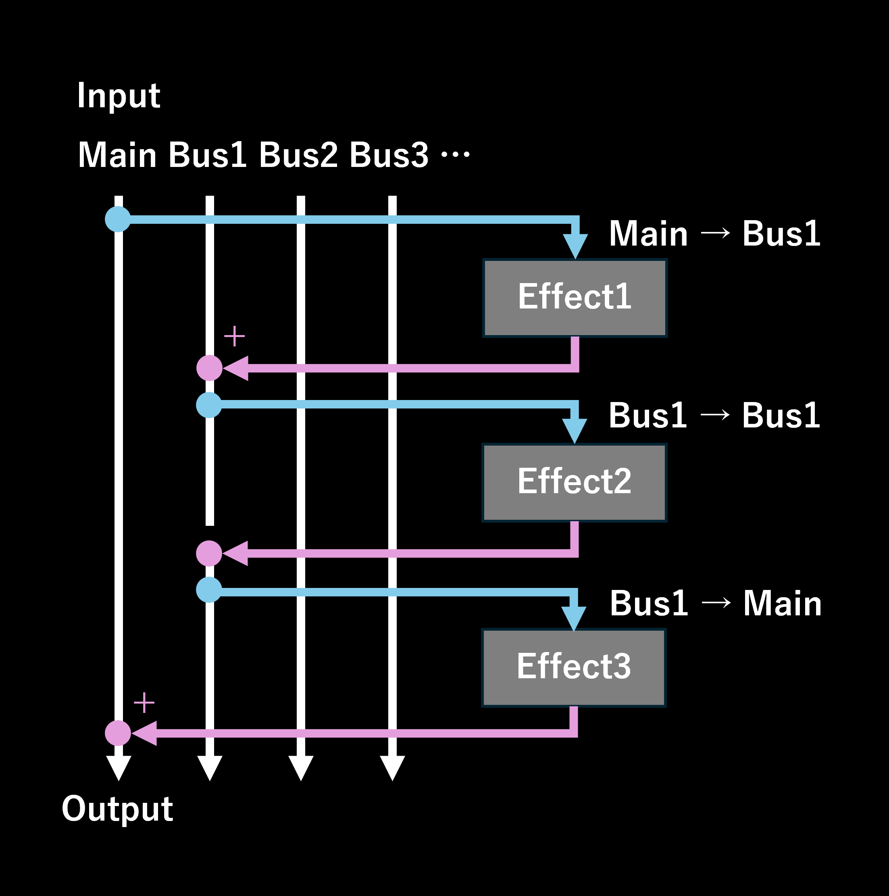

# 버스 기능 사용 방법

버스 기능은 효과들 간의 유연한 오디오 라우팅을 가능하게 하여 보다 복잡하고 다양한 오디오 처리를 수행할 수 있습니다.

## 기본 개념

- 각 효과는 처리할 오디오 신호를 받는 **입력 버스**와 처리된 오디오를 출력하는 **출력 버스**를 지정할 수 있습니다.
- 별도의 지정이 없으면, 각 효과는 기본적으로 **메인 버스**를 입력과 출력 모두에 사용합니다.
- 최대 4개의 추가 버스(**버스 1부터 버스 4까지**)를 사용할 수 있습니다.

## 효과의 입력 및 출력 버스 설정

- 각 효과에 표시된 위/아래 버튼의 왼쪽에 위치한 **라우팅 버튼**을 클릭합니다.
- 라우팅 버튼을 클릭하면 설정 대화 상자가 열리며, 여기서 메인 버스 또는 버스 1부터 버스 4까지 중에서 입력 버스와 출력 버스를 자유롭게 선택할 수 있습니다.
- 변경 사항은 즉시 적용됩니다.
- 대화 상자를 닫으려면, 오른쪽 상단의 × 버튼을 클릭하거나 대화 상자 외부를 클릭합니다.

- 입력 또는 출력이 버스 1 이상으로 설정된 경우, 라우팅 버튼 옆에 "버스 X→버스 Y"가 표시됩니다.
  - 예: 버스 2에서 오디오를 처리하여 버스 3으로 출력하는 경우, "버스 2→버스 3"으로 표시됩니다.

## 오디오 처리 메커니즘

- 효과는 위에서 아래로 순차적으로 처리됩니다.
- 각 효과는 지정된 입력 버스에서 오디오 신호를 받아 처리한 후, 결과를 출력 버스로 전송합니다.
- 입력 버스가 처음 사용되는 경우, 처리는 무음 상태에서 시작됩니다.
- 입력 버스와 출력 버스가 동일하면, 출력 버스의 오디오가 처리된 결과로 덮어쓰여집니다.
- 입력과 출력에 서로 다른 버스가 지정된 경우, 처리된 오디오가 출력 버스에 추가됩니다.
- 최종적으로, 오디오 재생은 항상 **메인 버스**에서 이루어집니다.

[← README로 돌아가기](README.md)
